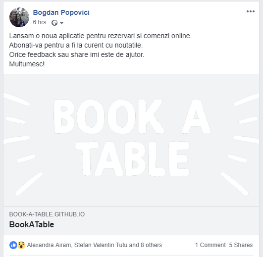
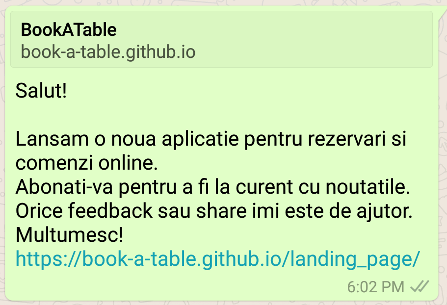
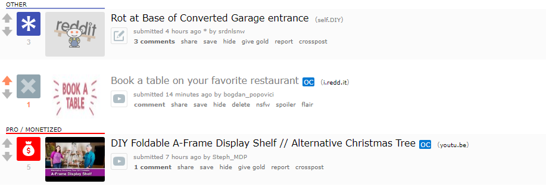
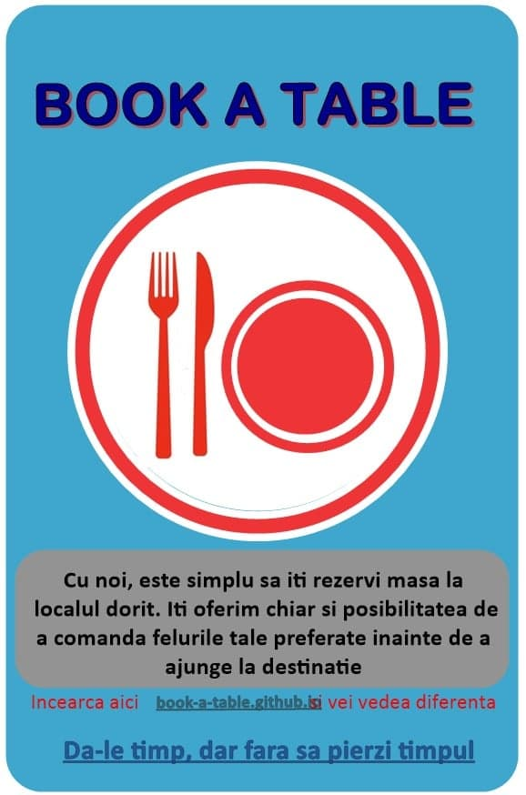

### Promovare

- Social media (Facebook, WhatApp, Reddit)

 

 

- Traditional (Afis si Comunicare directa)

 

-----------------------------------
- Promovarea pe retelele de socializare s-a facut prin share a link-ului. Promovarea traditionala a constat in impartirea unor afise sau prin comunicarea directa cu utilizatorul.
- Retelele de socializare au adus un numar mai mare de utilizatori decat caile traditionale in schimb caile tradionale au adus feedback productiv in timp real. 

-----------------------------------

#### [Pagina de prezentare](https://book-a-table.github.io/fiki/)
